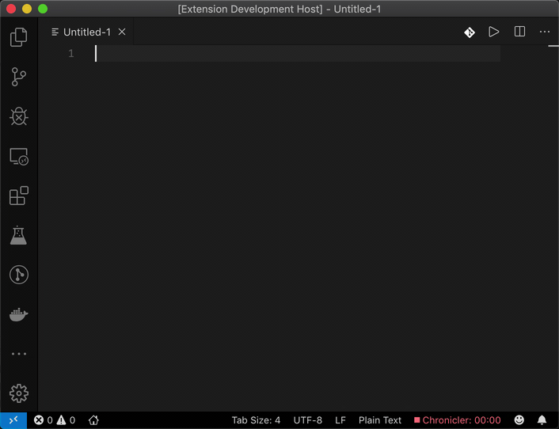

# CodeLens for i18n

This is a sample extension that shows the usage of the CodeLens API.

It is not intended as a production quality extension.

- Create a new file
- Write anything
- Click on the CodeLens for action example
- Can be enabled or disabled by command palette

## Demo



## VS Code API

### `languages` module

- [`languages.registerCodeLensProvider`](https://code.visualstudio.com/api/references/vscode-api#languages.registerCodeLensProvider)

### CodeLens Provider

- [`CodeLensProvider`](https://code.visualstudio.com/api/references/vscode-api#CodeLensProvider)
- [`CodeLensProvider.provideCodeLenses`](https://code.visualstudio.com/api/references/vscode-api#CodeLensProvider.provideCodeLenses)
- [`CodeLensProvider.resolveCodeLens`](https://code.visualstudio.com/api/references/vscode-api#CodeLensProvider.resolveCodeLens)

## Running the Sample

# 🌐 CodeLens for i18n Extension

VS Code extension hỗ trợ tìm kiếm và chỉnh sửa các chuỗi i18n trực tiếp trong code.

## ✨ Tính năng

### 🔍 **Tự động phát hiện i18n strings**
- Hỗ trợ pattern: `t('key')`, `t("key")`, `t(`key`)`
- **Multiline support**: 
  ```javascript
  t(
    'ACCOUNT.DISPLAY_NAME_UNKNOWN'
  )
  ```
- **Recursive scanning**: Tìm kiếm file .json trong tất cả subfolder

### 📁 **Cấu trúc thư mục linh hoạt**

#### Cấu trúc phẳng:
```
i18n/
├── en.json
├── vi.json
└── fr.json
```

#### Cấu trúc nested:
```
i18n/
├── locales/
│   ├── en/
│   │   ├── common.json
│   │   └── auth.json
│   └── vi/
│       ├── common.json
│       └── auth.json
└── modules/
    ├── auth/
    │   ├── en.json
    │   └── vi.json
    └── dashboard/
        ├── en.json
        └── vi.json
```

### 🎯 **Locale mapping thông minh**

| Cấu trúc file | Locale key | Ví dụ |
|---------------|------------|-------|
| `i18n/en.json` | `en` | Root level |
| `i18n/locales/en/common.json` | `locales.en.common` | Nested path |
| `i18n/modules/auth/en.json` | `modules.auth.en` | Module based |

### 🛠 **Chỉnh sửa trực tiếp**
- **Click CodeLens** để mở dialog chỉnh sửa
- **Xem tất cả translations** cho 1 key
- **Chỉnh sửa translation** hiện có
- **Thêm locale mới** 
- **Auto-save** với đường dẫn file chính xác

## 🚀 Cài đặt & Sử dụng

### 1. **Build Extension**
```bash
npm install
npm run compile
```

### 2. **Test Extension**
- Nhấn `F5` để mở Extension Development Host
- Mở file có chứa `t('key')` patterns
- CodeLens sẽ hiển thị translations

### 3. **Cấu hình thư mục i18n**

#### Via Command Palette:
`Cmd+Shift+P` → "CodeLens for i18n: Setting i18n folder"

#### Via Context Menu:
Right-click folder trong Explorer → "Add to i18n folders"

#### Via Settings:
```json
{
  "codelens-i18n.i18nFolder": [
    "i18n",
    "src/locales", 
    "assets/translations"
  ]
}
```

### 4. **File Structure Examples**

#### Simple structure:
```json
// i18n/en.json
{
  "welcome": {
    "message": "Welcome!"
  },
  "user": {
    "greeting": "Hello, user!"
  }
}
```

#### Module-based structure:
```json
// i18n/modules/auth/en.json
{
  "auth": {
    "form": {
      "username": "Username",
      "password": "Password"
    }
  }
}
```

## 🎯 Code Examples

### Supported Patterns:
```javascript
// Single line
const msg1 = t('welcome.message');
const msg2 = t("user.greeting");
const msg3 = t(`app.title`);

// Multiline
const msg4 = t(
    'ACCOUNT.DISPLAY_NAME_UNKNOWN'
);

const msg5 = t(
    "auth.form.username"
);

// Nested trong expressions
showMessage(t(
  'error.validation.required'
));
```

## ⚙️ Commands

| Command | Description |
|---------|-------------|
| `codelens-i18n.enableCodeLens` | Bật CodeLens |
| `codelens-i18n.disableCodeLens` | Tắt CodeLens |
| `codelens-i18n.openI18nFolderSetting` | Cấu hình thư mục i18n |
| `codelens-i18n.addToI18nFolders` | Thêm folder vào danh sách i18n |

## 🔧 Configuration

```json
{
  "codelens-i18n.enableCodeLens": true,
  "codelens-i18n.i18nFolder": [
    "i18n",
    "src/locales",
    "assets/translations"
  ]
}
```

## 🐛 Troubleshooting

### CodeLens không hiển thị:
- Kiểm tra `enableCodeLens` setting
- Đảm bảo có file .json trong thư mục i18n
- Restart Extension Development Host

### File save không thành công:
- Kiểm tra quyền write vào thư mục
- Đảm bảo JSON syntax hợp lệ

### Performance với nhiều file:
- Extension tự động cache data
- Chỉ reload khi file .json thay đổi

## 📝 Development

### Build & Watch:
```bash
npm run watch    # Auto compile on change
npm run compile  # One-time compile
npm run lint     # Check code quality
```

### Test Files:
- `test-i18n.js` - Basic patterns
- `test-multiline.js` - Multiline patterns  
- `test-nested.js` - Nested structure

## 🎉 Features Demo

1. **Open test files** và xem CodeLens
2. **Click CodeLens** để edit translations
3. **Add new locales** 
4. **Configure multiple i18n folders**
5. **Test nested directory structures**